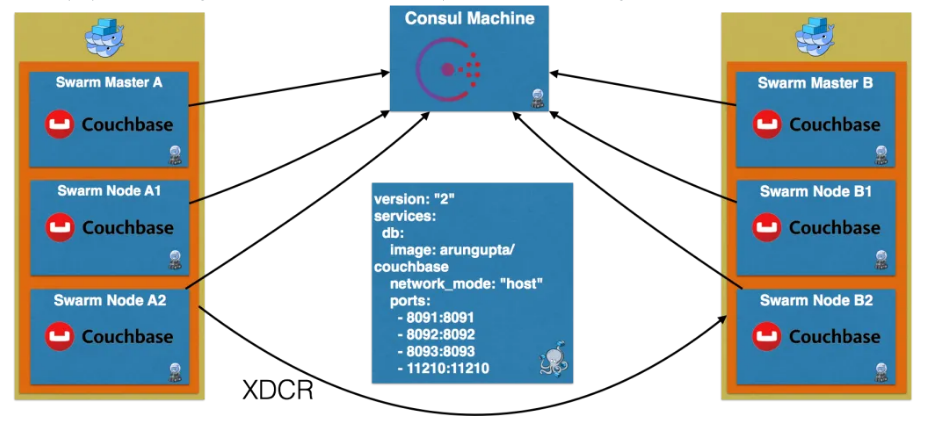
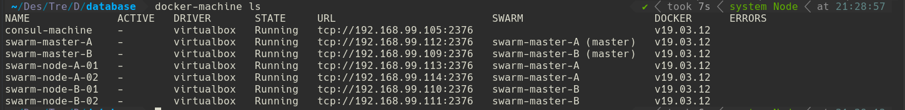
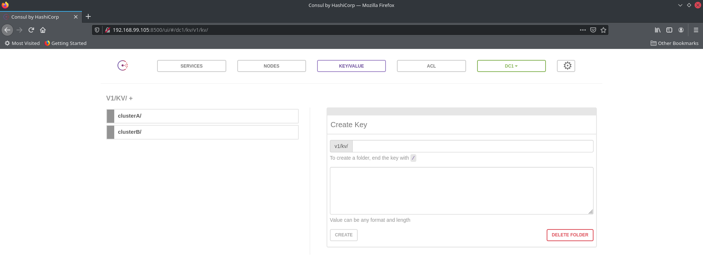
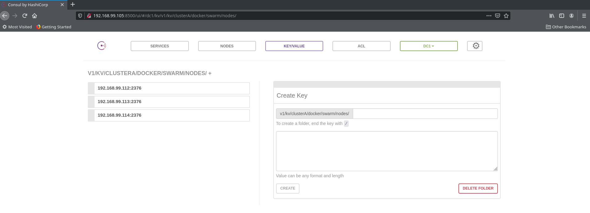
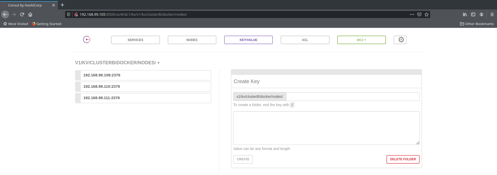

# Case 1

This project creates a Couchbase cluster over a Docker Swarm cluster. XDCR is then configured between these two Couchbase clusters.



## Requirments

- VirtualBox
- Docker
- Docker-machine
- Docker-compose
- Swarm

## Steps

- Create 2 data centers using Docker Swarm
- Run Couchbase containers on each node of Docker Swarm
- Create a Couchbase cluster on each Docker Swarm cluster
- Set up XDCR between two Couchbase clusters

In this project will use Consul, to register each node in Swarm with a discovery service.

* To create and start Consul with Docker Machine :

```
$ ./create_and_start_consul.sh
```


* To create 2 data centers use Swarm.  create_swarm_cluster.sh script creates 2 Swarm cluster with one "master" and two "worker" :

```
$ ./create_swarm_cluster.sh A
$ ./create_swarm_cluster.sh B
```



* Check consul and clusters

```
$ docker-machine ip consul-machine
```

* Check consul-machine-ip-address:8500







* Run Couchbase Containers on each node using docker-compose.yml file

Install docker-compose node machines :

```
$ sudo curl -L "https://github.com/docker/compose/releases/download/1.29.1/docker-compose-$(uname -s)-$(uname -m)" -o /usr/local/bin/docker-compose
$ sudo chmod +x /usr/local/bin/docker-compose
$ docker-compose --version
```

* Copy docker-compose.yml to node machines and run :

```
$ eval "$(docker-machine env --swarm swarm-master-A)"
$ docker-compose scale db=3
$ eval "$(docker-machine env --swarm swarm-master-B)"
$ docker-compose scale db=3
```

* Create/Rebalance Couchbase cluster


```
$ ./create-couchbase-cluster.sh $cluster
$ ./rebalance-couchbase-cluster.sh $cluster
```

* Setup XDCR from A to B

```
$ ./setup-xdcr.sh A B
```

## References

* https://blog.couchbase.com/couchbase-xdcr-docker-swarm-machine-compose/
